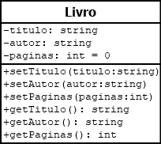
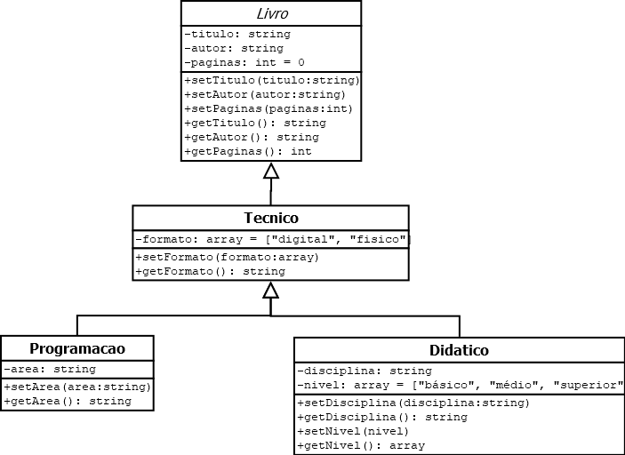

# php-poo-exercicios 

## Exercicio 1
 
1. Crie um novo repositório chamado php-poo-exercicios

2. Coloque dentro dele a pasta diagramas (disponível na Rede em UC7)

3. Analise o diagrama abaixo e implemente a classe Livro no PHP

4. Crie um arquivo index.php, importe a classe e crie pelo menos um objeto a partir dela, definindo um título, autor e número de páginas.

5. Mostre os dados na página usando tags HTML da maneira que preferir.

## Exercicio 2

1. Implemente a subclasse Tecnico (herdando tudo da superclasse Livro) e adicione também suas próprias propriedades e métodos. Obs.: veja que a propriedade formato é um array com valores pré-definidos.

2. Implemente as subclasses Programacao e Didatico (herdando tudo da subclasse Tecnico) e adicione também suas próprias propriedades e métodos.

3. Na index.php, crie alguns objetos do tipo Tecnico, Programação e Didático e atribua alguns valores a eles. Em seguida, mostre alguns destes dados usando tags HTML.

## Exercicio 3

1. Aplique pelo menos um namespace visando organizar o acesso às classes existentes.
2. Faça a configuração necessária para que o Composer gerencie o carregamento automático (autoload) de todas as classes do seu exercício.
3. Faça os ajustes necessários no arquivo index.php para que seja possível usar o autoload de classes
4. Crie uma nova classe chamada Web herdando os recursos da classe Programacao.
5. Coloque nela apenas um método construtor contendo um comando echo 'Livros de Programação Web'
6. Faça o Composer atualizar a lista de classes do autoload.
7. Volte para a index.php, faça a chamada desta classe e crie um objeto para ela.
8. Dê um var_dump neste objeto

#### Passa passo exercicio 3 

- Faça o name //Declarando namespace --> namespace Exemplar; nas classes das pasta src que você quer usar o namespace usei em todas classe do src na linha 3  

- Crie na raiz um arquivo chamado composer.json  escreva ...
{
    "name" : "aline/php-poo-exercicios", --> (seu nome e depois o nome do arquivo que você esta usando )
    "description" : "Exercicios  PHP com Orientação a Objeto e com classes gerenciadas pelo Composer", --> (Descrição que você quiser)
    "autoload" : {
        "psr-4" : {
            "Exemplar\\" : "src/"  --> (nome da pasta que você colocou o namespace nesse caso só usei a src e não tinha outra pasta nela ) 
        }
    }
}

-  DEpois gerar os arquivos com o cmd

- cmd  pasta que você quer  escreve cmd vai abrir o cmd
1. digite no cmd   C:\xampp\htdocs\php-poo-exercicios>composer -V e entre (Verificar se está com json está ativo ) 
2. digite no cmd C:\xampp\htdocs\aulas-php-poo> digite composer dumpautoload e entre 
3. Digitando o  composer dumpautoload vai aparecer uma pasta na raiz chamada vendor 
4. clie na raiz a pasta .gitignore e dentro dela escreva   /vendor  

- No index require_once "vendor/autoload.php";
- depois $livroTecnico = new  Tecnico;    ($livroTecnico  é o nome que você deu pode ser qualquer um   = new  Tecnico é a pasta do src nome da classe que quer usar  )
- fazendo isso vai criar o use em cima assim....
use Exemplar\Didatico;
use Exemplar\Programacao;
use Exemplar\Tecnico;

OBS para fazer  o vendor isso precisa ter feito  Download  desse site https://getcomposer.org/ e baixar o Composer-Setup.exe 
Cuidado para está na pasta xampp os passo a passo da instalação